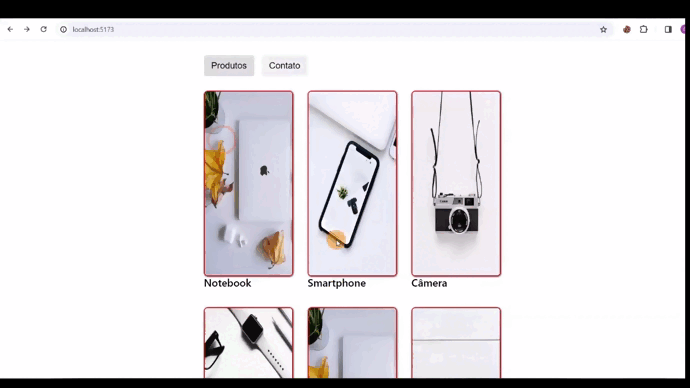

# FETCH DE PRODUTOS COM REACT



Projeto Desenvolvido onde sera realizado um fetch dos produtos, criando rotas com seu id e imagens, alem da pagina de contato

## 🧪 Tecnologias

Esse projeto foi desenvolvido com as seguintes tecnologias:

- [React](https://reactjs.org)
- [JavaScript](https://developer.mozilla.org/pt-BR/docs/Web/JavaScript)

Para iniciá-lo, siga os passos abaixo:

```bash
# Instalar as dependências
$ npm install react-router-dom

# Iniciar o projeto
$ npm run dev
```
